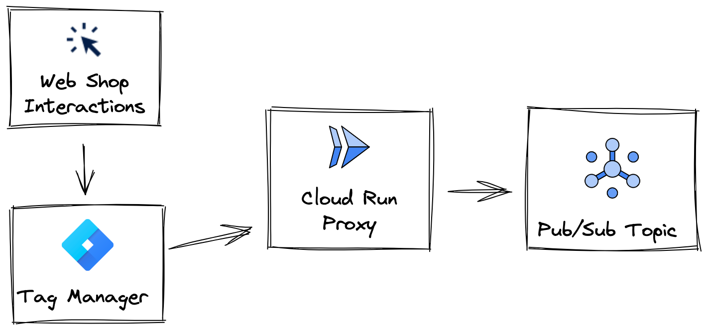
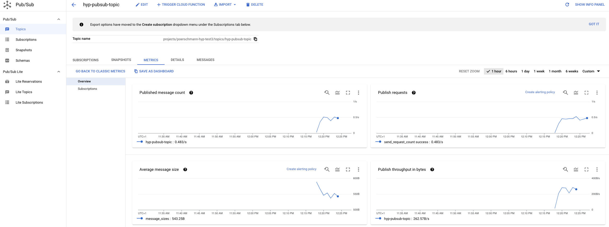
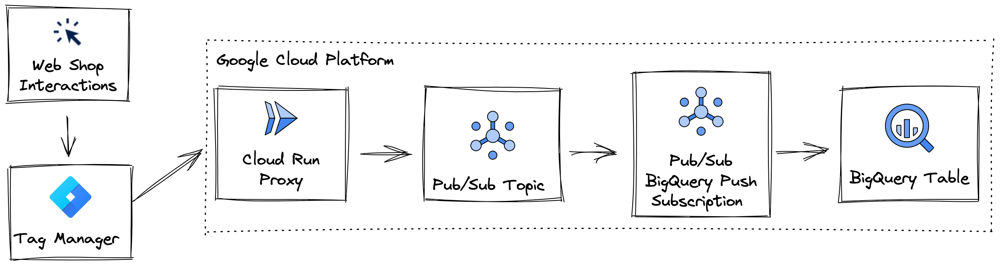
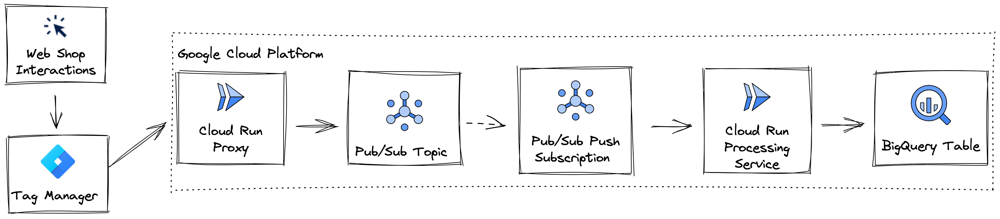
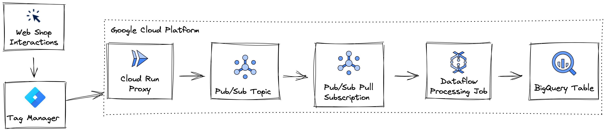

# Data Ingestion and Transformation

You are an e-commerce start-up. Your web-shop app is the heart of your business.

Your company decided to improve engagement and drive up revenue through data-driven insights.

You already have google tag manager set up for activity tracking. Great! Only the data pipeline is missing.

As Data Engineer you want to set up a solution to collect and analyze user interactions as shown below.  


## Challenge Preparation

Before you jump into the challenges make sure you GCP project is prepared by: 

... setting your Google Cloud Project.
```
export GCP_PROJECT=<project-id>
gcloud config set project $GCP_PROJECT
```

... setting your compute zone.
```
gcloud config set compute/zone europe-west1
```

... cloning the github repo
```
git clone https://github.com/NucleusEngineering/hack-your-pipe.git
```

... moving to the challenge directory
```
cd hack-your-pipe/01_ingest_and_transform/11_challenge
```

... changing the project id in `./terraform.tfvars` to your own project id

... building the basic permissions & networking setup via terraform apply.
```
terraform apply -var-file terraform.tfvars
```

### Organizational Policies

Depending on the setup within your organization you might have to [overwrite some organizational policies](https://cloud.google.com/resource-manager/docs/organization-policy/creating-managing-policies#boolean_constraints) for the examples to run.

For example, the following policies should not be enforced. 

```
constraints/sql.restrictAuthorizedNetworks
constraints/compute.vmExternalIpAccess
constraints/compute.requireShieldedVm
constraints/storage.uniformBucketLevelAccess
constraints/iam.allowedPolicyMemberDomains
```


## Challenge 0:

You are using Google Tag Manager for the respective ad tracking.

Your data stream is running. You need to make sure that incoming messages are ingested into the cloud reliably.

How would you ingest the data reliably based on your current knowledge? Which GCP and/or non-GCP tools would you use? 
For now focus on the ingestion part of things.
How would you collect data points and bring them into your cloud environment reliably?

No implementation needed yet. Please solely think about the architecture.

<details><summary>Hint</summary>

[Pub/Sub](https://cloud.google.com/pubsub/docs/overview) might be useful for this.

</details>


<details><summary>Suggested Solution</summary>

We will track user events on our website using [Google Tag Manager](https://developers.google.com/tag-platform/tag-manager).
To receive Google Tag manager events in our cloud environment we will use [Cloud Run](https://cloud.google.com/run/docs/overview/what-is-cloud-run) to set up a proxy service.
This proxy serves as public facing endpoint which can for example be set up as [custom tag](https://support.google.com/tagmanager/answer/6107167?hl=en) in Google Tag Manager.

To distribute the collected data points for processing you will use a [Pub/Sub](https://cloud.google.com/pubsub/docs/overview) topic.

Our starting point will look something like this:



</details>

## Challenge 1.1: Building a container
[Cloud Run](https://cloud.google.com/run/docs/overview/what-is-cloud-run) allows to set up serverless services based on a container we define.
Thus, the one of the fastest, most scalable and cost-efficient ways to build our proxy is Cloud Run.

We need to build a container with the code for our proxy server.
[Cloud Container Registry](https://cloud.google.com/artifact-registry/docs/overview) is a convenient choice for a GCP artifact repository.
But of course you could use any other container repository.

The repository `01_ingest_and_transform/11_challenge/cloud-run-pubsub-proxy` contains the complete proxy code.

Create a new container repository named `pubsub-proxy`.
Build the container described by `01_ingest_and_transform/11_challenge/cloud-run-pubsub-proxy/Dockerfile` in it.

<details><summary>Hint</summary>

You can use the [gcloud builds submit](https://cloud.google.com/sdk/gcloud/reference/builds/submit) command.

</details>


<details><summary>Suggested Solution</summary>

```
export RUN_PROXY_DIR=cloud-run-pubsub-proxy

gcloud builds submit $RUN_PROXY_DIR --tag gcr.io/$GCP_PROJECT/pubsub-proxy
```

Validate the successful build with:

```
gcloud container images list
```

You should see something like:
```
NAME: gcr.io/<project-id>/pubsub-proxy
Only listing images in gcr.io/<project-id>. Use --repository to list images in other repositories.
```

</details>

## Challenge 1.2:
You created a new proxy server container repo.
Next, create a new Cloud Run Service named `hyp-run-service-pubsub-proxy` based on the container you built.

Then save the endpoint URL for your service as environment variable `$ENDPOINT_URL`.


<details><summary>Hint</summary>

Check out the [Cloud Run Documentation](https://cloud.google.com/run/docs/deploying#service).

You can deploy services in multiple ways. For example through the console or command line.

</details>


<details><summary>Suggested Solution</summary>

To deploy a new Cloud Run service from your container you can use:

```
gcloud run deploy hyp-run-service-pubsub-proxy --image gcr.io/$GCP_PROJECT/pubsub-proxy:latest --region=europe-west1 --allow-unauthenticated
```

To save the service endpoint URL in the environment variable `$ENDPOINT_URL` run: 

```
export ENDPOINT_URL=https://pubsub-proxy-my-service-<id>-uc.a.run.app
```

</details>


## Challenge 1.3: 
Next, a messaging queue with [Pub/Sub](https://cloud.google.com/pubsub/docs/overview) will allow us to collect all messages centrally to then distribute them for processing.

Set up a Pub/Sub topic named `hyp-pubsub-topic`.


<details><summary>Hint</summary>

The [documentation](https://cloud.google.com/pubsub/docs/admin#pubsub_create_topic-Console) will help to create the topic via console or command line.

</details>

<details><summary>Suggested Solution</summary>

Use this command in the Cloud Shell to create the topic via command line.

```gcloud pubsub topics create hyp-pubsub-topic```

OR follow [these](https://cloud.google.com/pubsub/docs/admin#pubsub_create_topic-Console) steps to create the topic via Cloud Console.

</details>

## Validate Event Ingestion

You can now stream website interaction data points through a Cloud Run Proxy Service into your Pub/Sub Topic.

The folder `01_ingest_and_transform/11_challenge/datalayer` contains everything you need to simulate a click-stream.
You will find four .json files that define different types of messages.
Furthermore, you can find the script `synth_data_stream.py`.

Run to direct an artificial click stream at your pipeline.

```
python3 ./datalayer/synth_data_stream.py --endpoint=$ENDPOINT_URL
```

After a minute or two validate that your solution is working by inspecting the [metrics](https://cloud.google.com/pubsub/docs/monitor-topic) of your Pub/Sub topic.
Of course the topic does not have any consumers yet. Thus, you should find that messages are queuing up.

By default you should see around .5 messages per second streaming into the topic.



# Part 2: Bring raw data to BigQuery as efficient as possible

Now that your data ingestion is working correctly we move on to set up your processing infrastructure.
Data processing infrastructures often have vastly diverse technical and business requirements. 
We will find the right setup for three completely different settings.


## Challenge 2.1
[ELT is in!](https://cloud.google.com/bigquery/docs/migration/pipelines#elt)  Imagine you don't actually want to set up processing.
Instead, you would like to build a [modern Lakehouse structure](https://cloud.google.com/blog/products/data-analytics/open-data-lakehouse-on-google-cloud) with ELT processing.
Therefore, your  main concern at this point is to bring the incoming raw data into your Data Warehouse as cost-efficient as possible.
Data users will worry about the processing.

To start out we aim for rapid iteration. We plan using BigQuery as Data Lakehouse - Combining Data Warehouse and Data Lake).

With your current knowledge, which would be the most lightweight architecture to support this use case?

Let's think about and discuss your architecture ideas first. Don't implement anything just yet!

<details><summary>Suggested Solution</summary>

One solution for this challenge would be to use BigQuery as Data Warehouse and a [Pub/Sub BigQuery Subscription](https://cloud.google.com/pubsub/docs/bigquery) as delivery tool.

This elegant setup completely gets rid of the cost and maintenance of a separate data processing tool set.

Our pipeline will look something like this:



</details>


## Challenge 2.2
To implement our lean ELT pipeline we need:
- BigQuery Dataset
- BigQuery Table
- Pub/Sub BigQuery Subscription

Before you continue please make sure that your Pub/Sub Service Account named something like `service-<project-number>@gcp-sa-pubsub.iam.gserviceaccount.com` has the roles `bigquery.dataEditor` and `bigquery.metadataViewer` granted. 
This permits writing to BigQuery directly.

```
gcloud iam service-accounts add-iam-policy-binding \
  --member serviceAccount:<pubsub_service_account_email> \
  --role roles/bigquery.dataEditor \
  --project <project_id>
```

```
gcloud iam service-accounts add-iam-policy-binding \
  --member serviceAccount:<pubsub_service_account_email> \
  --role roles/bigquery.metadataViewer \
  --project <project_id>
```

Once permissions are set up start with creating a BigQuery Dataset named `ecommerce_sink`. The Dataset should contain a table named `pubsub_direct`.

Continue by setting up a Pub/Sub Subscription named `hyp_subscription_bq_direct` that directly streams incoming messages in the BigQuery Table you created. 


<details><summary>Hint</summary>

This [Pub/Sub](https://cloud.google.com/pubsub/docs/create-subscription#subscription) and [BigQuery](https://cloud.google.com/bigquery/docs/datasets) documentation might help.

</details>


<details><summary>Suggested Solution</summary>

To create the BigQuery Dataset run:

```
bq --location=europe-west1 mk \
    --dataset \
    $GCP_PROJECT:ecommerce_sink
```

To create the BigQuery destination table run:
```
bq mk --table $GCP_PROJECT:ecommerce_sink.pubsub_direct data:STRING
```

Alternatively create the [Dataset](https://cloud.google.com/bigquery/docs/datasets#create-dataset) and [Table](https://cloud.google.com/bigquery/docs/tables#create_an_empty_table_with_a_schema_definition) via Cloud Console as indicated in the documentation.


To create the Pub/Sub subscription in the console run:

```

gcloud pubsub subscriptions create hyp_subscription_bq_direct \
  --topic=hyp-pubsub-topic \
  --bigquery-table=$GCP_PROJECT:ecommerce_sink.pubsub_direct

```

Alternatively, the [documentation](https://cloud.google.com/pubsub/docs/create-subscription#pubsub_create_bigquery_subscription-console) walks step-by-step through the creation of a BigQuery subscription in the console.

</details>

## Validate ELT Pipeline implementation

You can now stream website interaction data points through your Cloud Run Proxy Service, Pub/Sub Topic & Subscription all the way up to your BigQuery destination table.

Run 

```
python3 ./datalayer/synth_data_stream.py --endpoint=$ENDPOINT_URL
```

to direct an artificial click stream at your pipeline. If your datastream is still running from earlier you don't need to initiate it again.

After a minute or two you should find your BigQuery destination table populated with data points. 
The metrics of Pub/Sub topic and Subscription should also show the throughput.
Take a specific look at the un-acknowledged message metrics in Pub/Sub.
If everything works as expected it should be 0.


# Part 3: Apply simple transformations and bring data to BigQuery as cost-efficient as possible
ELT is a relatively new concept. Cheap availability of Data Warehouses allows efficient on-demand transformations. That saves storage and increases flexibility. All you have to manage are queries, not transformed datasets. And you can always go back to data in it's raw form.

Although, sometimes it just makes sense to apply transformation on incoming data directly. 
What if we need to apply some general cleaning, or would like to apply machine learning inference on the incoming data at the soonest point possible?

Traditional [ETL](https://cloud.google.com/bigquery/docs/migration/pipelines#etl) is a proven concept to do just that.

But ETL tools are maintenance overhead. In our example, you don't want to manage a Spark, GKE cluster or similar.Specifically, your requirement is a serverless and elastic ETL pipeline.

That means your pipeline should scale down to 0 when unused or up to whatever is needed to cope with a higher load.

## Challenge 3.1
Based on your current knowledge of GCP and non-GCP tools. What would be the ideal architecture to fulfill these requirements?

Don't implement anything just yet. Let's only discuss the architecture for now.

<details><summary>Suggested Solution</summary>



</details>


## Challenge 3.2
First component of our lightweight ETL pipeline is a BigQuery Table named `cloud_run`.
The BigQuery Table should make use of the schema file `./datalayer/ecommerce_events_bq_schema.json`.
The processing service will stream the transformed data into this table.

<details><summary>Hint</summary>

The [BigQuery documentation](https://cloud.google.com/bigquery/docs/tables) might be helpful to follow. 

</details>

<details><summary>Suggested Solution</summary>

Run this command

```
bq mk --table <project-id>:ecommerce_sink.cloud_run --schema ./datalayer/ecommerce_events_bq_schema.json 
```

OR follow the documentation on how to [create a BigQuery table with schema through the console](https://cloud.google.com/bigquery/docs/tables#console).

</details>


## Challenge 3.3
Second, let's set up your Cloud Run Processing Service. `./01_ingest_and_transform/11_challenge/processing-service` contains all necessary files.

Inspect the `Dockerfile` to understand how the container will be build.

`main.py` defines the web server that handles the incoming data points. Inspect `main.py` to understand the web server logic.
As you can see `main.py` is missing two code snippets.

Complete the web server with the BigQuery client and Client API call to insert rows to BigQuery from a json object.
Use the BigQuery Python SDK.

Before you start coding replace the required variables in `config.py` so you can access them safely in `main.py`.

<details><summary>Hint</summary>

[Documentation for the BigQuery Python Client](https://cloud.google.com/python/docs/reference/bigquery/latest)

</details>

<details><summary>Suggested Solution</summary>

Define the [BigQuery Python Client](https://cloud.google.com/python/docs/reference/bigquery/latest/google.cloud.bigquery.client.Client#google_cloud_bigquery_client_Client_insert_rows_json) as followed:
```
client = bigquery.Client(project=config.project_id, location=config.location)
```

Insert rows form JSON via [the Client's insert_rows_json method](https://cloud.google.com/python/docs/reference/bigquery/latest/google.cloud.bigquery.client.Client#google_cloud_bigquery_client_Client_insert_rows_json):
```
errors = client.insert_rows_json(table_id, rows_to_insert)  # Make an API request.
```

</details>

Once the code is completed build the container from `./01_ingest_and_transform/11_challenge/processing-service` into a new [Container Repository](https://cloud.google.com/artifact-registry/docs/overview) named `data-processing-service`.

<details><summary>Hint</summary>

You can use the [gcloud builds submit](https://cloud.google.com/sdk/gcloud/reference/builds/submit) command.

</details>

<details><summary>Suggested Solution</summary>

```
export PROCESSING_SERVICE_DIR=processing-service

gcloud builds submit $PROCESSING_SERVICE_DIR --tag gcr.io/$GCP_PROJECT/data-processing-service
```

Validate the successful build with:

```
gcloud container images list
```

You should see something like:
```
NAME: gcr.io/<project-id>/pubsub-proxy
NAME: gcr.io/<project-id>/data-processing-service
Only listing images in gcr.io/<project-id>. Use --repository to list images in other repositories.
```

</details>

## Challenge 3.4
Define a Pub/Sub subscription named `hyp_subscription_cloud_run` that can forward incoming messages to an endpoint.
The actual endpoint will be defined in the next challenge.

<details><summary>Hint</summary>

Read about [types of subscriptions](https://cloud.google.com/pubsub/docs/subscriber) and [how to create them](https://cloud.google.com/pubsub/docs/create-subscription#create_subscriptions).

</details>

<details><summary>Suggested Solution</summary>

You will need to create a Push Subscription to the Pub/Sub topic we already defined.

Use this command: 

```
gcloud pubsub subscriptions create hyp_subscription_cloud_run \
    --topic=hyp-pubsub-topic \
    --push-endpoint=PUSH_ENDPOINT
```

OR 

read it can be [defined via the console](https://cloud.google.com/pubsub/docs/create-subscription#pubsub_create_push_subscription-console).

</details>


## Validate lightweight ETL pipeline implementation

You can now stream website interaction data points through your Cloud Run Proxy Service, Pub/Sub Topic & Subscription, Cloud Run Processing and all the way up to your BigQuery destination table.

Run 

```
python3 ./datalayer/synth_data_stream.py --endpoint=$ENDPOINT_URL
```

to direct an artificial click stream at your pipeline. No need to reinitialize if you still have the clickstream running from earlier.

After a minute or two you should find your BigQuery destination table populated with data points. 
The metrics of Pub/Sub topic and Subscription should also show the throughput.
Take a specific look at the un-acknowledged message metrics in Pub/Sub.
If everything works as expected it should be 0.


# Part 4: Apply transformation, apply aggregation & bring data to BigQuery as efficient as possible
Cloud Run works smooth to apply simple data transformations. On top of that it scales to 0. So why not stop right there?

Let's think one step further. Imagine for example you need to apply aggregations, not only transformations. 
For example, you might need to support a real time dashboard to display the sum of all purchases made every minute (aggregation over multiple datapoints). Or you might want to apply real time ML inference of a demanding ML model (distributed compute) before data is written into your Data Warehouse.

For extremely latency sensitive applications, and cases in which aggregations or disstributed compute make the transformations stateful neither ELT nor Cloud Run will do the job.
This is where [Apache Beam](https://beam.apache.org/documentation/basics/) comes to shine!

## Challenge 4.1
Based on your current GCP and non-GCP knowledge.
How would the ideal architecture to satisfy above requirements look like?

Don't start building just yet, lets discuss the architecture ideas first.

<details><summary>Suggested Solution</summary>

Dataflow is a great tool to integrate into your pipeline for high volume data streams with complex transformations and aggregations.
It is based on the open-source data processing framework Apache Beam.



</details>


## Challenge 4.2 
First component of our dataflow ETL pipeline is a BigQuery Table named `dataflow`.
The BigQuery Table should make use of the schema file `./datalayer/ecommerce_events_bq_schema.json`.
The processing service will stream the transformed data into this table.

<details><summary>Suggested Solution</summary>

Run this command

```
bq mk --table <project-id>:ecommerce_sink.dataflow --schema ./datalayer/ecommerce_events_bq_schema.json 
```

OR follow the documentation on how to [create a BigQuery table with schema through the console](https://cloud.google.com/bigquery/docs/tables#console).

</details>


Second component is the connection between Pub/Sub topic and Dataflow job.

Define a Pub/Sub subscription named `hyp_subscription_dataflow` that can serve this purpose.
You will define the actual dataflow job in the next step.

<details><summary>Hint</summary>

Read about [types of subscriptions](https://cloud.google.com/pubsub/docs/subscriber) and [how to create them](https://cloud.google.com/pubsub/docs/create-subscription#create_subscriptions).

</details>

<details><summary>Suggested Solution</summary>

You will need to create a Pull Subscription to the Pub/Sub topic we already defined.
This is a fundamental difference to the Push subscriptions we encountered in the previous two examples.
Dataflow will pull the data points from the queue independently, depending on worker capacity.

Use this command: 

```
gcloud pubsub subscriptions create hyp_subscription_dataflow \
    --topic=hyp-pubsub-topic \
```

OR 

read how it can be [defined via the console](https://cloud.google.com/pubsub/docs/create-subscription#pull_subscription).

</details>


## Challenge 4.3
Finally, all we are missing is your Dataflow job to apply transformations, aggregations and connect Pub/Sub queue with BigQuery Sink.

[Templates](https://cloud.google.com/dataflow/docs/concepts/dataflow-templates) let you create Dataflow jobs based on pre-existing code. That makes it quick to set up and reusable.

You need to apply custom aggregations on the incoming data.
That means you need to create a dataflow job based on a [flex-template](https://cloud.google.com/dataflow/docs/guides/templates/using-flex-templates).

Find & examine the pipeline code in `.01_ingest_and_transform/11_challenhe/beam`.

The pipeline is missing some code snippets. You will have to add one code snippet in  `ExtractAndSumValue.extract()` and two snippets in `streaming_pipeline()`.

You need to design a pipeline that aggregates the sum of the purchased item value per user.
There should be an aggregation per 10 items purchased per user.

The aggregated values should be written into your BigQuery table.

<details><summary>Hint: Summing Aggregation</summary>

You are mapping Pcollection into key-value-pairs in the previous transform. Thus to aggregate and sum you will need to find the corresponding [Combine transform](https://beam.apache.org/documentation/programming-guide/#combine).

</details>

<details><summary>Hint: Read from PubSub Transform</summary>

The [Python Documentation](https://beam.apache.org/releases/pydoc/current/apache_beam.io.gcp.pubsub.html) should help.

</details>

<details><summary>Hint: Data Windowing</summary>

This is a challenging one. There are multiple ways of solving this.

Easiest is a [GlobalWindow](https://beam.apache.org/documentation/programming-guide/#using-single-global-window) with [AfterCount trigger](https://beam.apache.org/documentation/programming-guide/#event-time-triggers).

</details>


<details><summary>Suggested Solution: Summing Aggregation</summary>

The code should look something like this:

```
    def expand(self, pcoll):
        sum_val = (
            pcoll
            | beam.Map(lambda elem: (elem['user_id'], elem['ecommerce']['purchase']['value']))
            | beam.CombinePerKey(sum))
        return(sum_val)
```

</details>


<details><summary>Suggested Solution: Read from PubSub Transform</summary>

The code should look something like this:
```
    json_message = (p
                    # Listining to Pub/Sub.
                    | "Read Topic" >> ReadFromPubSub(subscription=subscription)
                    # Parsing json from message string.
                    | "Parse json" >> beam.Map(json.loads)
```

</details>


<details><summary>Suggested Solution: Data Windowing</summary>

The code should look something like this:

```
    fixed_windowed_items = (json_message
                            | 'Filter for purchase' >> beam.Filter(is_purchase)
                            | 'Global Window' >> beam.WindowInto(beam.window.GlobalWindows(),
                                                                 trigger=trigger.Repeatedly(
                                                                     trigger.AfterCount(10)),
                                                                 accumulation_mode=trigger.AccumulationMode.ACCUMULATING)
                            | 'ExtractAndSumValue' >> ExtractAndSumValue()
                            | 'FormatByRow' >> FormatByRow()
                            )
```

</details>

## Challenge 4.4

To create a flex-template we first need to build the pipeline code as container in the Container Registry.

Build the beam folder content as container named `beam-processing-flex-template` to your Container Registry.

<details><summary>Suggested Solution</summary>

Run

```
export DATAFLOW_TEMPLATE=beam

gcloud builds submit $DATAFLOW_TEMPLATE --tag gcr.io/$GCP_PROJECT/beam-processing-flex-template
```

</details>


Create a Cloud Storage Bucket named `gs://<project-id>-ecommerce-events`. Create a Dataflow flex-template based on the built container and place it in your new GCS bucket.

<details><summary>Hint</summary>

Checkour the [docs](https://cloud.google.com/sdk/gcloud/reference/dataflow/flex-template/build) on how to build a dataflow flex-template.

</details>


<details><summary>Suggested Solution</summary>

Create a new bucket by running 
```
gsutil mb -c standard -l $GCP_REGION gs://$GCP_PROJECT-ecommerce-events
```

Build the flex-template into your bucket using:
```
gcloud dataflow flex-template build gs://$GCP_PROJECT-ecommerce-events/df_templates/dataflow_template.json --image=gcr.io/$GCP_PROJECT/beam-processing-flex-template --sdk-language=PYTHON
```
</details>

## Challenge 4.5

Run a Dataflow job based on the flex-template you just created.

<details><summary>Hint</summary>

The [documentation on the flex-template run command](https://cloud.google.com/sdk/gcloud/reference/dataflow/flex-template/run) should help.

</details>


<details><summary>Suggested Solution</summary>

```
gcloud dataflow flex-template run my-job --template-file-gcs-location=gs://$GCP_PROJECT-ecommerce-events/df_templates/dataflow_template.json --region=europe-west1 --parameters=service-account-email="retailpipeline-hyp@$GCP_PROJECT.iam.gserviceaccount.com" --max-workers=1 --network=terraform-network
```

</details>

## Validate Dataflow ETL pipeline implementation

You can now stream website interaction data points through your Cloud Run Proxy Service, Pub/Sub Topic & Subscription, Dataflow job and all the way up to your BigQuery destination table.

Run 

```
python3 ./datalayer/synth_data_stream.py --endpoint=$ENDPOINT_URL
```

to direct an artificial click stream at your pipeline. No need to reinitialize if you still have the clickstream running from earlier.

After a minute or two you should find your BigQuery destination table populated with data points. 
The metrics of Pub/Sub topic and Subscription should also show the throughput.
Take a specific look at the un-acknowledged message metrics in Pub/Sub.
If everything works as expected it should be 0.


