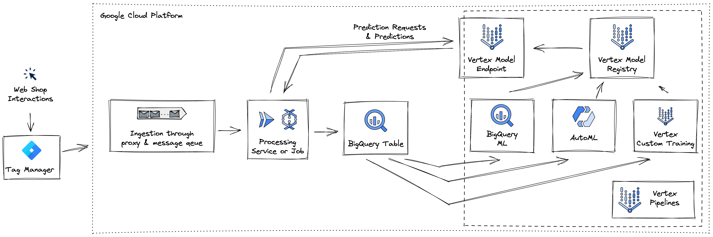

# Developing and deploying Machine Leaning Models on GCP

Welcome to the second part of Hack Your Pipe!

So far you discovered multiple options to ingest and transform data most efficiently.
In this section you go one step further with your data, but constantly build on the previous learnings.
You will train and deploy Machine Learning models that detect anomalies in the incoming click stream.

Hereby we will focus on automation, simplicity and reliability of every step in the Machine Learning Lifecycle.

The architecture you are going to implement will look something like this:




## Prerequisites: Create Synthetic Data

You will use the click stream data from the [ingest and transform section](https://github.com/NucleusEngineering/hack-your-pipe/tree/main/01_ingest_and_transform) as an example.

If you haven't worked through the ingest and transform chapter follow [`01_ingest_and_transform/12_solution/README.md`](https://github.com/NucleusEngineering/hack-your-pipe/blob/main/01_ingest_and_transform/12_solution/README.md).

Before moving on make sure that your BigQuery project has a dataset `ecommerce_sink` with the tables `cloud_run`, `dataflow` and `pubsub_direct`.
The tables should be populated with at least 1000 data points each.

## Git clone repo 

```
git clone https://github.com/NucleusEngineering/hack-your-pipe.git
cd hack-your-pipe
```

## Set-up Cloud Environment

### Initialize your account and project

If you are using the Google Cloud Shell you can skip this step.

```
gcloud init
```

### Set Google Cloud Project
Enter your GCP Project ID as `GCP_PROJECT` in `./config_env.sh` as `PUSH_ENDPOINT` & set the environment variables.
```
source config_env.sh
```

```
gcloud config set project $GCP_PROJECT
```

### Enable Google Cloud APIs

```
gcloud services enable aiplatform.googleapis.com storage.googleapis.com notebooks.googleapis.com dataflow.googleapis.com artifactregistry.googleapis.com 
```

### Set compute zone

```
gcloud config set compute/zone $GCP_REGION
```

### Create a service account.

```
gcloud iam service-accounts create retailpipeline-hyp \
    --display-name="retailpipeline-hyp"
```
You might already have this from running the ingest and transform section. In such a case just add the below permissions.

### ... with the necessary permissions.
```
gcloud projects add-iam-policy-binding $GCP_PROJECT \
    --member="serviceAccount:retailpipeline-hyp@$GCP_PROJECT.iam.gserviceaccount.com" \
    --role="roles/storage.objectAdmin"

```

```
gcloud projects add-iam-policy-binding $GCP_PROJECT \
    --member="serviceAccount:retailpipeline-hyp@$GCP_PROJECT.iam.gserviceaccount.com" \
    --role="roles/aiplatform.user"

```

```
gcloud projects add-iam-policy-binding $GCP_PROJECT \
    --member="serviceAccount:retailpipeline-hyp@$GCP_PROJECT.iam.gserviceaccount.com" \
    --role="roles/automl.serviceAgent"

```

<!-- ### Organizational Policies

Depending on the setup within your organization you might have to [overwrite some organizational policies](https://cloud.google.com/resource-manager/docs/organization-policy/creating-managing-policies#boolean_constraints) for the examples to run.

For example, the following policies should not be enforced. 

```
constraints/sql.restrictAuthorizedNetworks
constraints/compute.vmExternalIpAccess
constraints/compute.requireShieldedVm
constraints/storage.uniformBucketLevelAccess
constraints/iam.allowedPolicyMemberDomains
``` -->

## Run ML Pipeline

### Set pipeline config options

Set the config options in [`02_activate/22_solution/config.py`](https://github.com/NucleusEngineering/hack-your-pipe/blob/main/02_activate/22_solution/config.py). 


### Run Kubeflow Pipeline in Vertex (BigQueryML model)

[Vertex Pipelines](https://cloud.google.com/vertex-ai/docs/pipelines/introduction) is an end-to-end and serverless ML orchestration tool. It's supports the open source frameworks [Kubeflow](https://www.kubeflow.org/) and [TFX](https://www.tensorflow.org/tfx).

The full process from model training to deployment can be orchestrated using Vertex Pipelines. 

To kick off the pipeline simply install the dependencies
```
pip install -r ./requirements.txt
```

and then run

```
python3 kf_pipe.py
```

## Set up processing pipe for real time inference

Once the model is trained and deployed you will include a real time inference call in the data pipeline and again stream the results to BigQuery.

Use terraform to create a new BigQuery table as sink for your predictions. 

```
terraform init
```

```
terraform plan
```

```
terraform apply -var-file terraform.tfvars
```


To include real time inference in your pipeline you have to update the Cloud Run processing service.
That means you need build and deploy a new container version to your service. Don't forget to update the `inf_processing_service/config.py`.

Build the new container.

```
gcloud builds submit $RUN_INFERENCE_PROCESSING_SERVICE --tag gcr.io/$GCP_PROJECT/inference-processing-service
```

Deploy the new container to your Cloud Run service.

```
gcloud run deploy hyp-run-service-data-processing --image=gcr.io/$GCP_PROJECT/inference-processing-service:latest --region=europe-west1
```

## Run Kubeflow Pipeline in Vertex (Custom Container)

Two additional steps are needed to run the pipeline with custom training and prediction. We start by preparing the code to create custom training and prediction containers.
Containers are providing you a way to write your own preferred data processing and model training with your preferred library and environment.

Make sure you update the config files in the `custom_train/trainer` and `custom_train/prediction` folders, and the file, `config_custom.py`.

Build the containers

```
gcloud builds submit custom_train/trainer/. --tag $TRAIN_IMAGE_URI
```
```
gcloud builds submit  custom_train/prediction/. --tag $PREDICT_IMAGE_URI 
```


And kick off the pipeline same as before
```
pip install -r ./requirements.txt
```

and then run

```
python3 kf_pipe_custom.py
```
