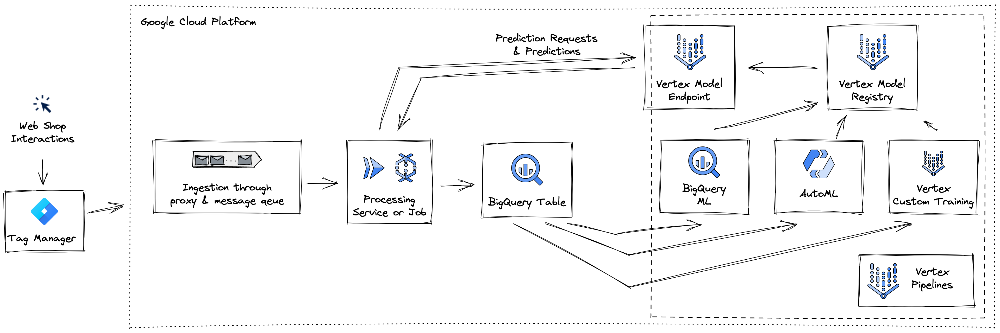

# Developing and deploying Machine Leaning Models on GCP

Welcome to the second part of Hack Your Pipe!

So far you discovered multiple options to ingest and transform data most efficiently.
In this section you go one step further with your data, but constantly build on the previous learnings.
You will train and deploy Machine Learning models that detect anomalies in the incoming click stream.

Hereby we will focus on automation, simplicity and reliability of every step in the Machine Learning Lifecycle.

The architecture you are going to implement will look something like this:

