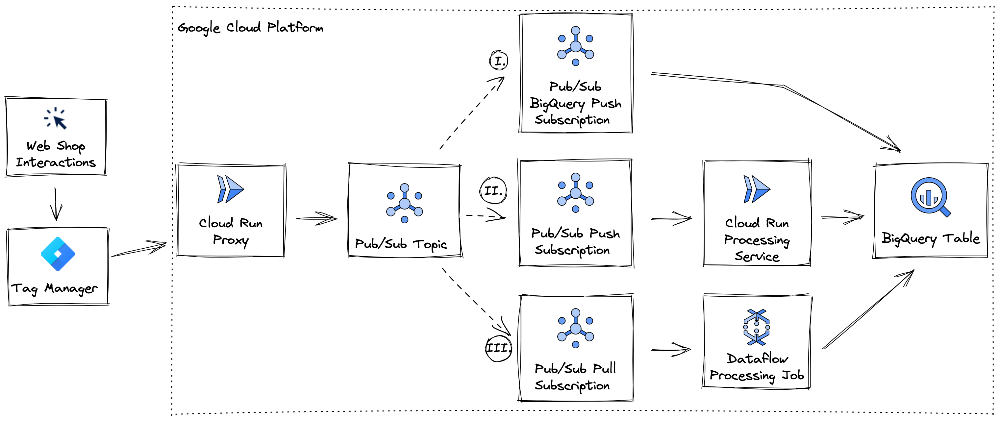

# Developing *efficient* Data Pipelines on GCP

Google Cloud Platform offers numerous possibilities and sample architectures to design data pipelines.
As always, there is no **ONE** perfect data architecture. It always depends!!   

The perfect architecture depends on the data-type, -volume and more. 
Business and tech requirements such as the number of data producers and consumers or the intended data activation are also essential. 

This repo provides practical guidance and sample architectures for the most common pipeline requirements I happened to come across with my customers.

## We will find three unique solutions to ingest click stream data into BigQuery.

All examples find unique solutions for **ingesting click-stream data from a web-store to BigQuery**. 

Imagine you are a Data Engineer with the task to monitor specific click stream data from your company's web store.
You already set up a Cloud Run Proxy Service that can be set-up as custom Tag in Google Tag Manager.
Also, you defined a Pub/Sub topic as central event-hub. 
Triggered events flow from Google Tag Manager through your Cloud Run Proxy to your Pub/Sub Topic.

Once events arrived in your central event-hub, you need to decide on how to process and move them to BigQuery.





### I. Lean ELT pipelines with raw data in BigQuery

Thinking about a scenario in which we aim to build the cheapest lowest maintenance data pipeline.
Our only requirement might be to transport the raw data into BigQuery.
For example, to design a Lakehouse structure.

Introducing the direct Pub/Sub to BigQuery subscription:

**Strengths:**
- No data processing tool = major cost saving
- No ETL maintenance
- Raw data in lakehouse allows view based processing on use-case basis
- Ingestion scales down to 0 and up without limits

**Weaknesses:**
- No processing or aggregations of ingested data before in BigQuery
- Raw data volume in lakehouse might grow quickly 
- Only limited sanity check possible when ingesting data


### II. Elastic ELT pipeline with Cloud Run

You might want to develop a pipeline that scales up and down easily, but still allows to apply simple transformations.
For example, you might want to make data sanity checks, apply default cleaning or run ML inference over your data.

Introducing Cloud Run as data processing tool:

**Strengths:**
- Scales down to 0 and up with (almost) no limits
- Easy integration of data transformations in any language and based on any dependencies
- Easy entry, no steep learning curve for Kubernetes like container orchestration

**Weaknesses:**
- No graphic interface to explore data transformation steps
- Only one-at-a-time datapoint handling, aggregations over multiple datapoints only possible once in BigQuery


### III. High-Volume ETL pipelines with complex aggregations using Dataflow


**Strengths:**
- Apache Beam allows for on-the-fly aggregations and windowing
- Dataflow offers a user interface, great for troubleshooting

**Weaknesses:**
- Dataflow never scales down to 0
- Despite serverless nature of dataflow, managing machines is extra overhead compared to e.g. Cloud Run


This repo provides an end to end example for streaming data from a webstore to BigQuery. It contains the following components that can be deployed all at once using Terraform or serve as indvidual examples.

- Cloud Run service that can be set-up as a custom tag in Google Tag Manager.
- Pub/Sub topic to consume the data
- Pub/Sub subscription to pull the data from the topic
- Dataflow streaming job using a Pub/Sub to BigQuery template
- BigQuery events table to store the data
- BigQuery SQL query to analyse the events

The data structure is based on the [Data Layer Ecommerce](https://developers.google.com/tag-manager/ecommerce-ga4) format recommended for Google Tag Manager.

## Git clone repo 

```
git clone https://github.com/jakobap/HackYourPipe.git
cd HackYourPipe
```

## Set-up Cloud Environment

### Initilize your account and project

If you are using the Google Cloud Shell you can skip this step.

```shell
gcloud init
```

### Set Google Cloud Project

```
export GCP_PROJECT=<project-id>
gcloud config set project $GCP_PROJECT
```

### Check Google Cloud Project config set correctly

```
gcloud config list
```

### Enable Google Cloud APIs

```
gcloud services enable compute.googleapis.com cloudbuild.googleapis.com artifactregistry.googleapis.com dataflow.googleapis.com
```

### Set compute zone

```
gcloud config set compute/zone europe-west1
```

# Build container

```
export $RUN_PROXY_DIR=cloud-run-pubsub-proxy

gcloud builds submit $RUN_PROXY_DIR --tag gcr.io/$GCP_PROJECT/pubsub-proxy
```

### List containers

Check that the container was succesfully created

```
gcloud container images list
```

You should see the following output:

```
NAME
gcr.io/<project-id>/pubsub-proxy
Only listing images in gcr.io/<project-id>. Use --repository to list images in other repositories.
```


## Deploy using Terraform

Use Terraform to deploy the following services defined in the `main.tf` file

- Cloud Run 1: Pub/Sub Proxy
- Cloud Run 2: Data Processing Service
- Pub/Sub Topic
- Pub/Sub Push Subscription
- Pub/Sub Pull Subscription
- Pub/Sub BigQuery Subscription
- Google Cloud Storage
- Dataflow Job
- BigQuery Table per pipeline

### Install Terraform

If you are using the Google Cloud Shell Terraform is already installed.

Follow the instructions to [install the Terraform cli](https://learn.hashicorp.com/tutorials/terraform/install-cli?in=terraform/gcp-get-started).

This repo has been tested on Terraform version `1.3.6` and the Google provider version  `4.32.0`

### Update Project ID in terraform.tfvars

Rename the `terraform.tfvars.example` file to `terraform.tfvars` and update the default project ID in the file to match your project ID.

Check that the file has been saved with the updated project ID value

```
cat terraform.tfvars
```

### Initialize Terraform

```
terraform init
```

### Create resources in Google Cloud

Run the plan cmd to see what resources will be created in your project.

**Important: Make sure you have updated the Project ID in terraform.tfvars before running this**

```
terraform plan
```

Run the apply cmd and point to your `.tfvars` file to deploy all the resources in your project.

```
terraform apply -var-file terraform.tfvars
```

This will show you a plan of everything that will be created and then the following notification where you should enter `yes` to proceed:

```
Plan: 20 to add, 0 to change, 0 to destroy.

Do you want to perform these actions?
  Terraform will perform the actions described above.
  Only 'yes' will be accepted to approve.

  Enter a value: 
```

### Terraform output

Once everything has successfully run you should see the following output:

```
google_compute_network.vpc_network: Creating...
.
.
.
Apply complete! Resources: 20 added, 0 changed, 0 destroyed.

Outputs:

cloud_run_proxy_url = https://pubsub-proxy-my-service-<id>-uc.a.run.app
```

## Simulate sending ecommerce events to Cloud Run Pub/Sub proxy using curl

Use the `cloud_run_proxy_url` value from the Terraform output to simulate sending ecommerce events to the Cloud Run Pub/Sub proxy.

#### Set Cloud Run Proxy URL

```
export ENDPOINT_URL=https://pubsub-proxy-my-service-<id>-uc.a.run.app
```

#### Create artificial event stream

Run the script `./datalayer/synth_data_stream.py` to direct a synthetic stream of events to the created endpoint.

```
python3 ./datalayer/synth_data_stream.py --endpoint=$ENDPOINT_URL
```

The program will generate and send a random event based on the samples in `./datalayer` every two seconds. 

After a minute or two you should find the BigQuery event tables populated.

### Terraform Destroy

Use Terraform to destroy all resources

```
terraform destroy
```
