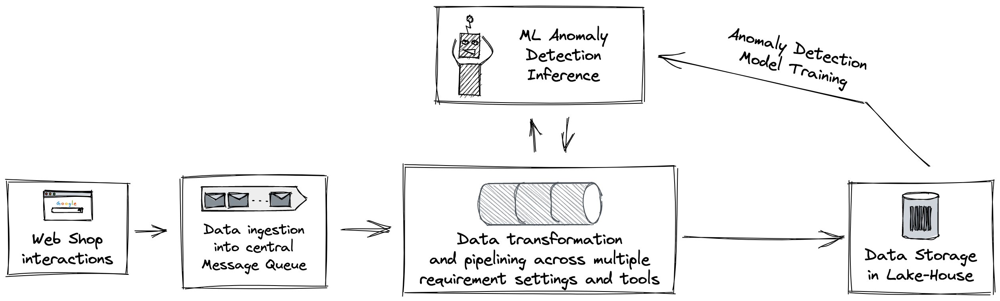

# Welcome to Hack Your Pipe!

In this repo you will find a series of demos and workshops on Data- and ML-Engineering best practices on GCP. 

For your webshop you will develop an end-to-end data pipeline, from collection, over transformation and up to activation of the interaction data. 

The workshop is split into first ingest and transform, and second activate.

In both folders you will find the challenge lab and working sample solution.
Every sample solution comes with instructions and terraform scripts needed for replication.

The challenge labs separate the solution development into interactive steps.
To maximize the learning you should aim to solving the challenge labs independently before looking at the solutions.

### Good luck and have fun!!